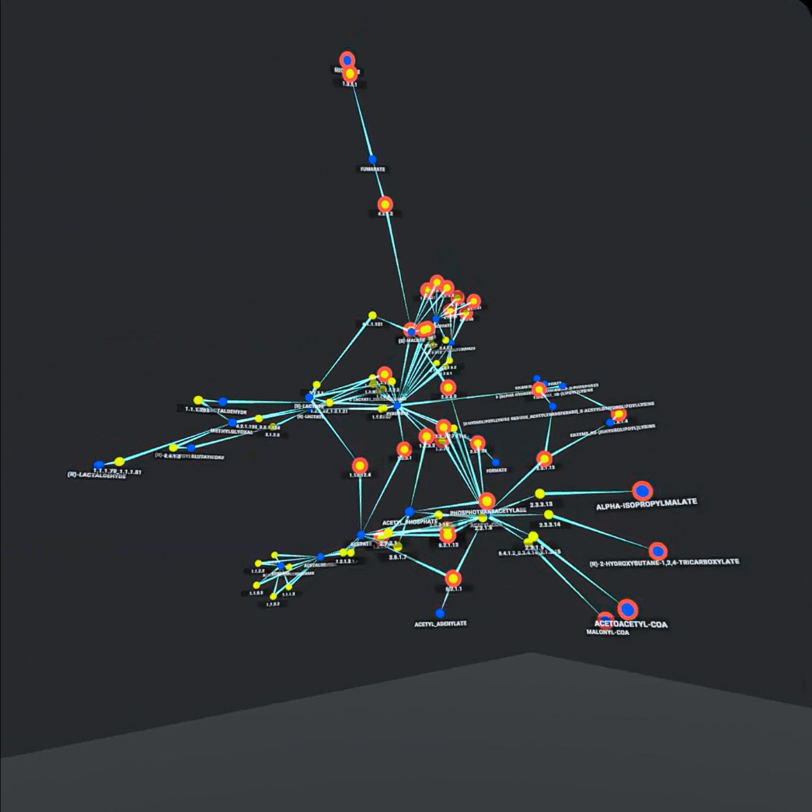
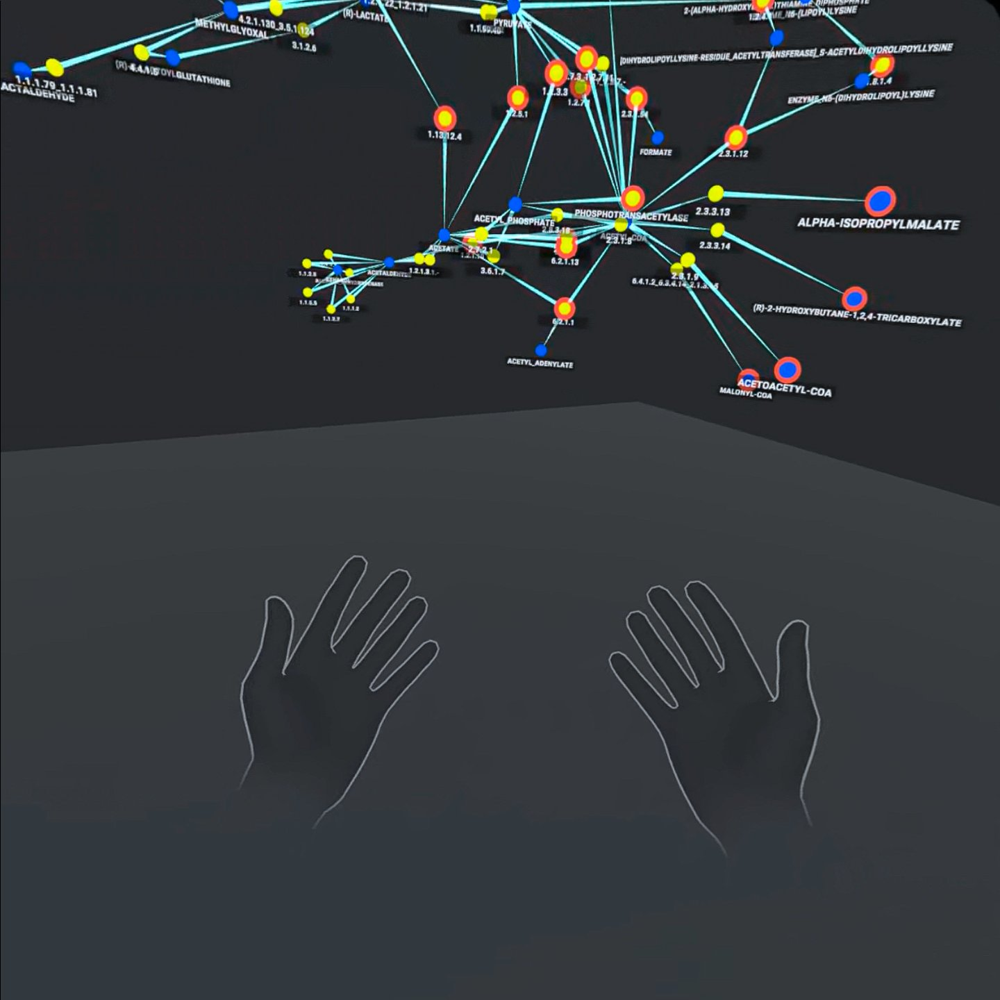
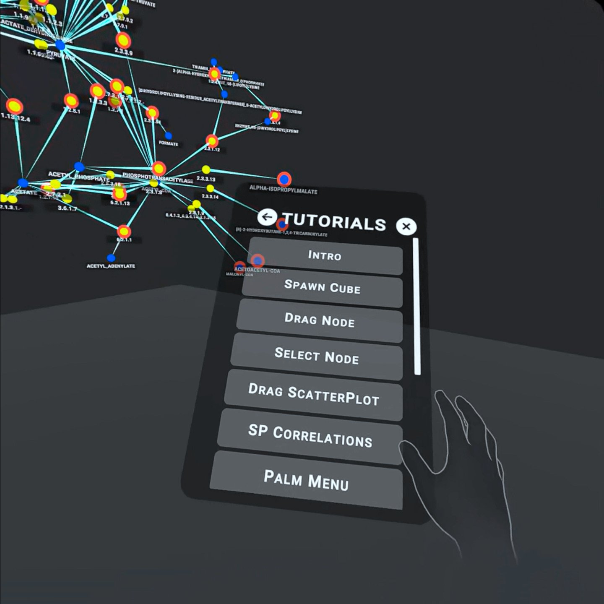

# VRPathways Tool

VRPathways Tool is an immersive data visualisation tool for complex metabolic pathways. 

This tool was developed in collaboration with The Commonwealth Scientific and Industrial Research Organisation(CSIRO) with the aim to deliver a tool that can help analyse data collected from a research that on predicting Alzhymer's Disease from cells found in the human saliva. [Link to paper](https://www.researchgate.net/publication/352434331_Salivaomics_as_a_Potential_Tool_for_Predicting_Alzheimer's_Disease_During_the_Early_Stages_of_Neurodegeneration).

VRPathways Tool was developed to work with [ImAxes](https://github.com/MaximeCordeil/ImAxes/tree/ImAxes2018), another immersive data visualisation tool for multidimensional data explorations.

[SOME PHOTOS SHOWING IMAXES FEATURES]

See video demonstration of VRPathways Tool:

## Prerequesites and Requirements
VRPathways Tool comes as a unity project.

Recommended Unity Editor version : [2021.2.14f1](https://unity3d.com/get-unity/download/archive) and up.

## Hardware and compatibility
[PC requirements??]

VRPathway Tool works with Oculus Rift CV1, Oculus Quest and Oculus Quest 2.

Handtracking is supported with the help of the recent Oculus SDK Tools.

## Launching Instructions
### Dataset
This tool allows you to load datasets with csv(any other formats allowed?) format. [Dataset requirements](https://github.com/MaximeCordeil/ImAxes/blob/ImAxes2018/README.md#launching-imaxes).

The dataset file should resemble something like this:

The project has one scene "PathwayScene". Attach the dataset to the "Source Data" field in the SceneManager from the scene hierarchy.

### Run PathwayScene from Editor
Make sure your Headset is connected and connected to your device.

Once dataset is attached to the SceneManager you can run the project by pressing the Play Button.

VRPathway initially loads the pyruvate metabolic pathway as the default pathway followed by other metabolic pathways that are linked to pyruvate metabolism.

### Building and Launching the project
You can build and launch the project onto your Oculus device, just make sure the dataset is attached to the SceneManger in PathwayScene.

## VRPathways Features
The scene is a freeroam environment where you can move around. The scene also allows you to use your hands via handtracking to interact with the pathway while in the scene.

### Grabbing and Selecting
Any grabbable object in the scene can be grabbed using a pinching gesture which involves your index finger and thumb, holding this gesture and moving your hand should allow you to grab objects.

A node can be selected by simply poking at at it with your **index finger**. When the right node is selected a node menu with the node's information should pop up. **NOTE: Only nodes with the red outline contain relevant data**. 

### Moving the pathway
The pathway can be moved around using a dodecahedron cube. To spawn the cube simply straighten your **left** arm foward and turn your palm to **face upwards** while your fingers are also straightened and closely attached to each other. The cube should now spawn and you should be able to grab it and move it around, the pathway should also move as it mimics the cube's movements.

### Palm Menu
You can access an interaction menu by straightening your **right** arm foward and turn your palm to **face upwards** while your fingers are also straightened and closely attached to each other.

### Tutorials
The tutorials menu can be accessed from the **palm menu** where you can learn about all the features VRPathways tool offers.

## Developers and Contributors
This project was developed by:
* [Alexander Pepicelli](https://github.com/pepar002) (University of South Australia) 
* [Cassian Kahema](https://github.com/caykay) (University of South Australia).

Contributors:
* [Dr. Andrew Cunningham](https://people.unisa.edu.au/Andrew.Cunningham) (University of South Australia)
* [Dr. Adam Drogemuller](https://people.unisa.edu.au/Adam.Drogemuller) (University of South Australia)

Clients:
* [Dr. Maxime Francois](https://people.csiro.au/f/m/maxime-francois) (CSIRO)
* [Dr. Wayne Leifert](https://people.csiro.au/l/w/wayne-leifert) (CSIRO)
* [Dr. Geoff Jarrad](https://www.researchgate.net/profile/Geoff-Jarrad) (CSIRO)
## License
[MIT](https://choosealicense.com/licenses/mit/)